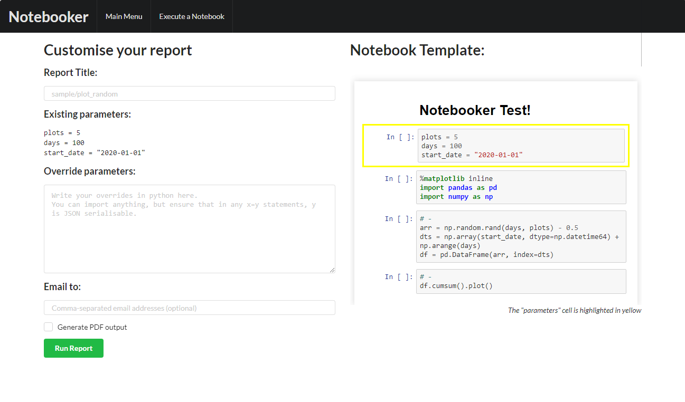
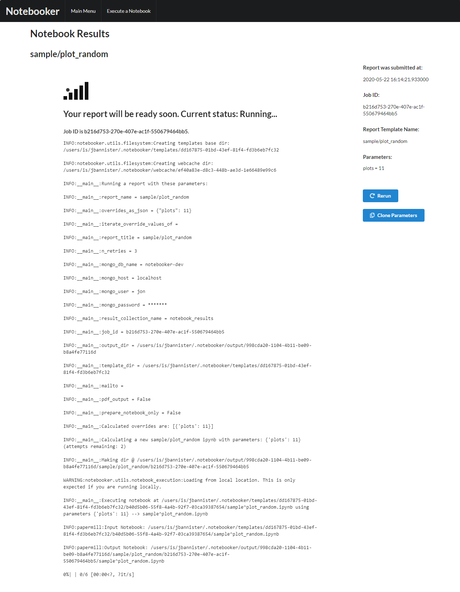
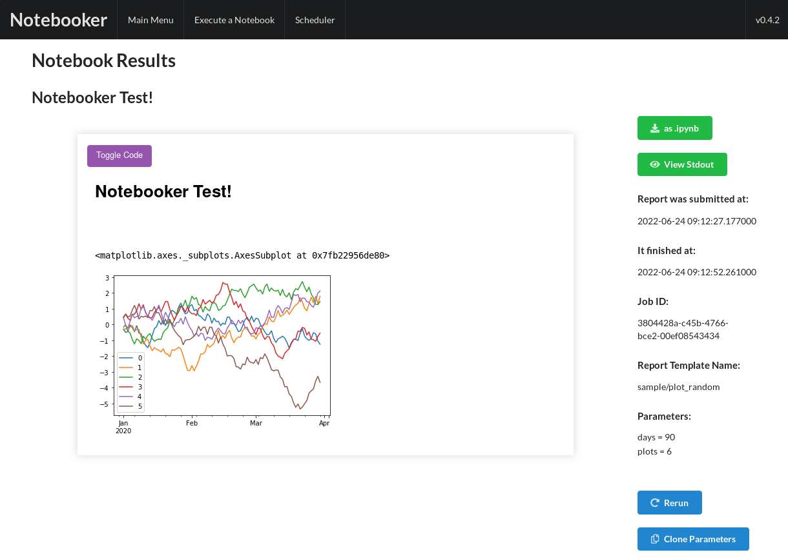
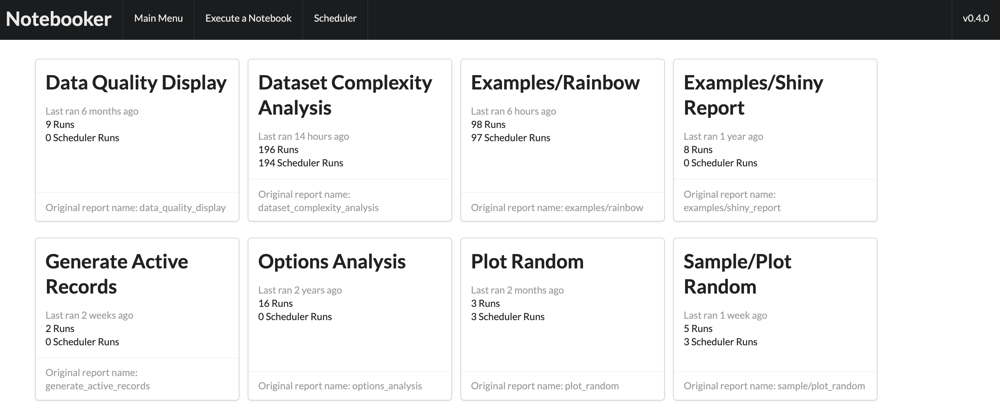

Productionise your Jupyter Notebooks, just as interactively as you wrote them.

## Run a jupyter notebook as a report with parameters

## Execute Jupyter notebooks either on the webservice or command line

## View the output of notebooks as static HTML

## All reports accessible on the home screen, regardless of how they were executed

## Getting started
See the (docs)[LINK THE DOCS HERE FIXME] for installation instructions.

Notebooker has been tested on Linux, Windows 10, and OSX; the webapp has been tested on Google Chrome.

# Contributors
Notebooker has been actively maintained at Man Group since late 2018, with the original concept built by 
[Jon Bannister](https://github.com/jonbannister). 
It would not have been possible without contributions from:

* [Jon Bannister](https://github.com/jonbannister)
* [Douglas Bruce](https://github.com/douglasbruce88)
* [Franek Jemiolo](https://github.com/FranekJemiolo)
* [Sam Ratcliff](https://github.com/sparks1372)
* [Matthew Dodds](https://github.com/doddsiedodds)
* [Dominik Christ](https://github.com/DominikMChrist)

And these fantastic projects:

* [Jupytext](<https://github.com/mwouts/jupytext>)
* [papermill](<https://github.com/nteract/papermill>)
* [nbconvert](<https://github.com/jupyter/nbconvert>)
* [Fomantic-UI](<https://github.com/fomantic/Fomantic-UI>)

